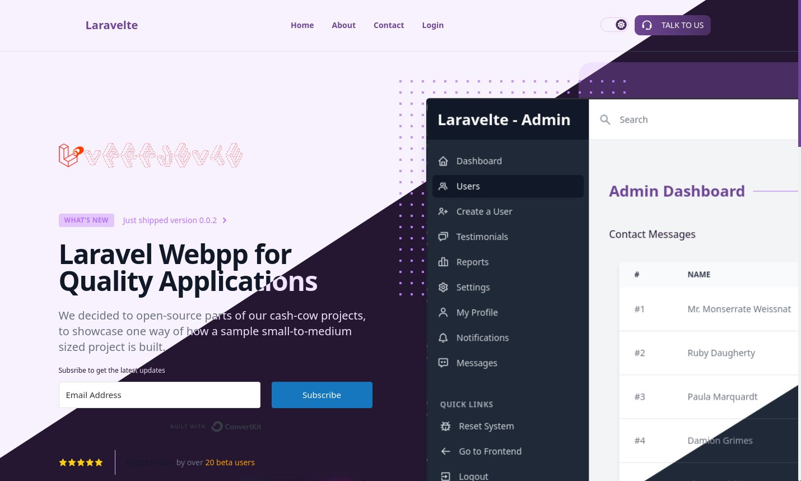
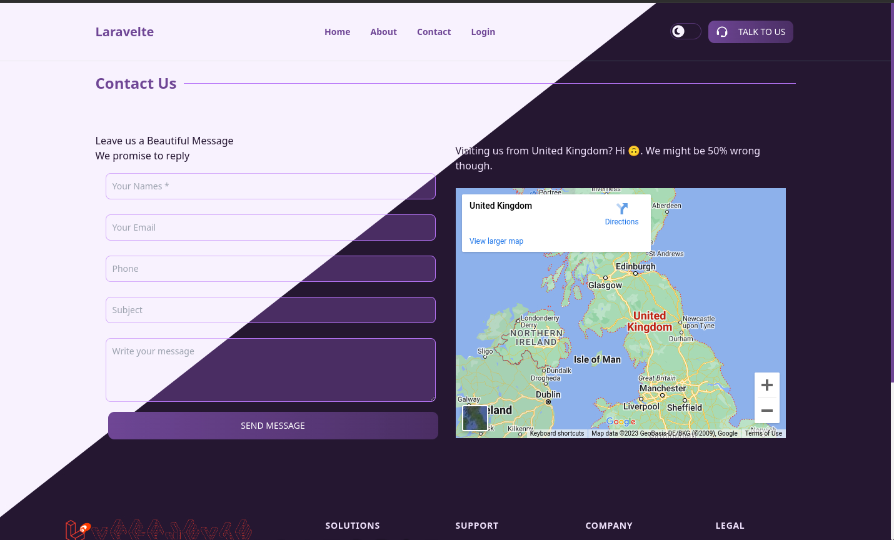
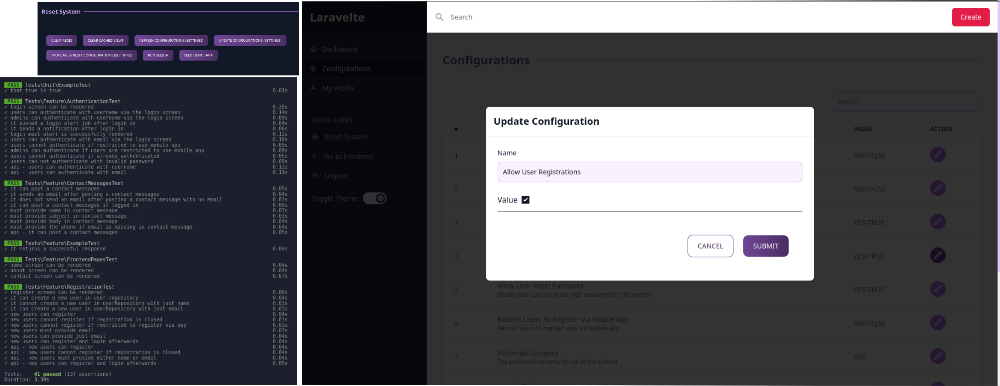
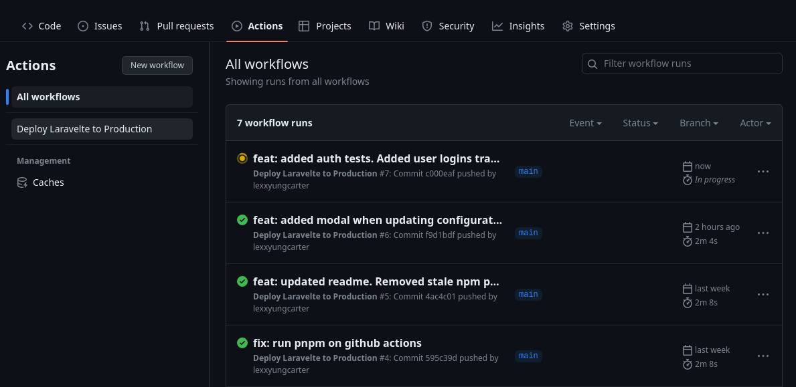

<p align="center">
<a href="https://github.com/lexxyungcarter/laravelte/actions"></a>
</p>







## About Laravelte

Laravelte is an entire webapp based on the [Laravel](https://laravel.com) web application framework and [Svelte](https://svelte.com) frontend. The main goals of this project is to provide a quick way to get started with your projects.

>NB: In this project, we shift our focus from "What controllers do I need?", "should I make a FormRequest for this?", "should this run asynchronously in a job instead?", etc. 

to
> "What does my application actually do?" Kinda like RPC


It features:
- [All Laravel Features](https://laravel.com).
- Light & Dark Mode.
- Quick Frontend Scaffolding via [Svelte](https://svelte.com) via [Inertiajs](https://inertiajs.com). Svelte is extremely fast, and provides less boilerplate as compared to [Vue](https://vuejs.org) and [React](https://react.com). 
- Different **Admin** and **User** dashboard support.
- CI/CD via [Github Actions](https://github.com/).
- [Laravel Actions](https://laravelactions.com/): Instead of creating controllers, jobs, listeners and so on, it allows you to create a PHP class that handles a specific task and run that class as anything you want.
- [Redis support](https://laravel.com/docs/queues) and Laravel Queues.
- [Real-time event broadcasting](https://laravel.com/docs/broadcasting).
- [i18N (Localization) - Multiple languages support](https://laravel.com/docs/10.x/localization#main-content).

Laravel is accessible, powerful, and provides tools required for large, robust applications.

Tooling:
- Vite v4
- Typescript
- TailwindCSS
- pnpm
- Laravel 10
- Laravel Sanctum
- Svelte 3
- Pest PHP Testing Library

### Testing
The project uses [Pest Testing Library](https://pestphp.com/) that is fantastic to use.

Tests have been grouped to:
```bash
# All tests
php artisan test

# Browser tests
php artisan test --group=browser

# api tests
php artisan test --group=api

# Setup tests
php artisan test --group=setup

# test in parallel
php artisan test --parallel
php artisan test --parallel --processes=4

# list of your ten slowest tests
php artisan test --profile
```

## Contributing

Thank you for considering contributing to the Laravel framework! The contribution guide can be found in the [Laravel documentation](https://laravel.com/docs/contributions).

## Code of Conduct

In order to ensure that the Laravel community is welcoming to all, please review and abide by the [Code of Conduct](https://laravel.com/docs/contributions#code-of-conduct).

## Security Vulnerabilities

If you discover a security vulnerability within Laravel, please send an e-mail to Taylor Otwell via [taylor@laravel.com](mailto:taylor@laravel.com). All security vulnerabilities will be promptly addressed.

## License

The Laravel framework is open-sourced software licensed under the [MIT license](https://opensource.org/licenses/MIT).
